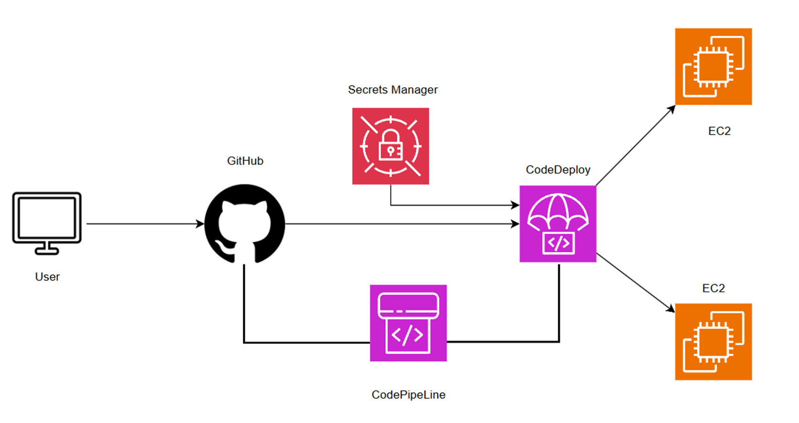
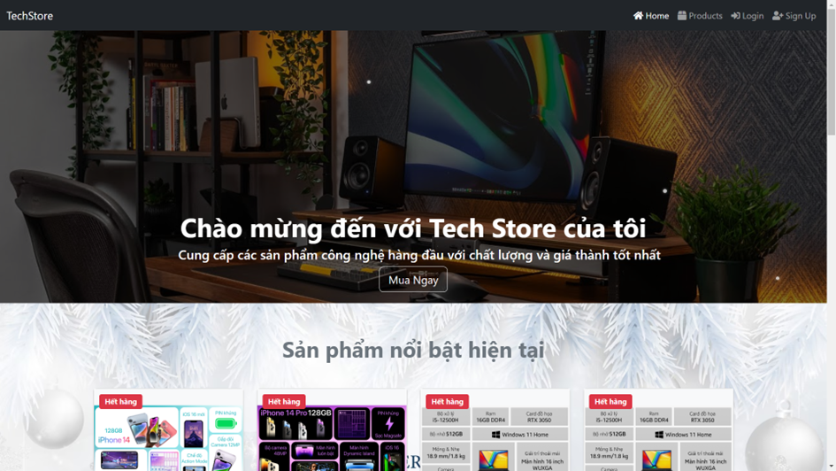
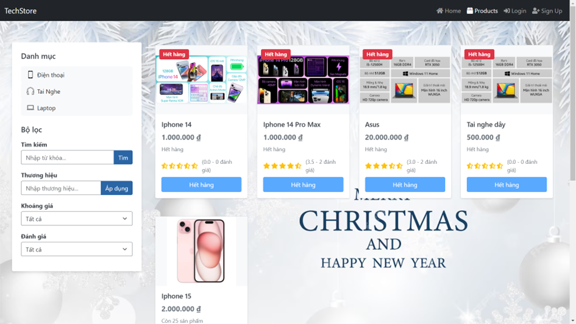
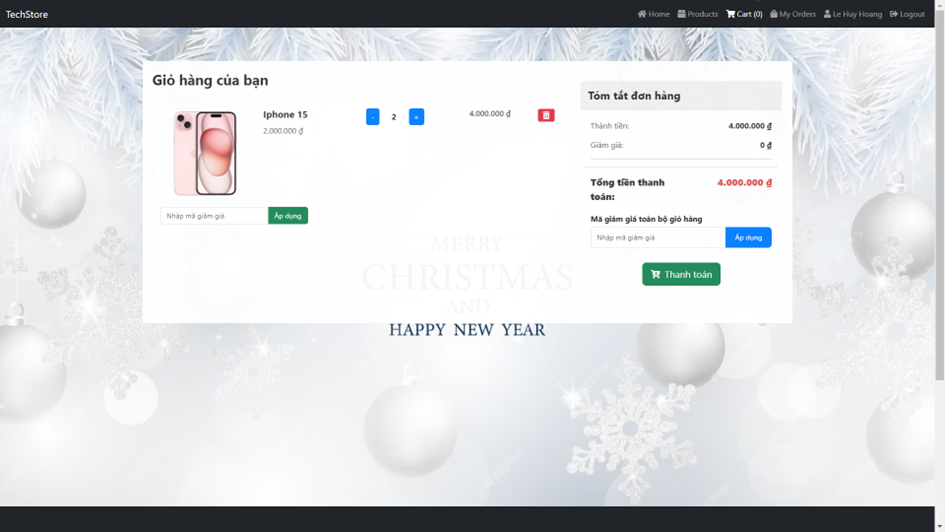
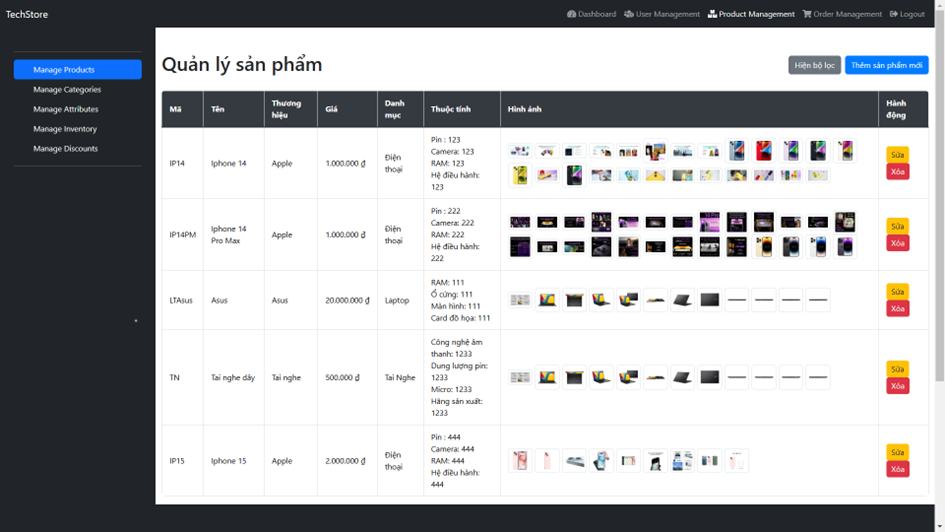
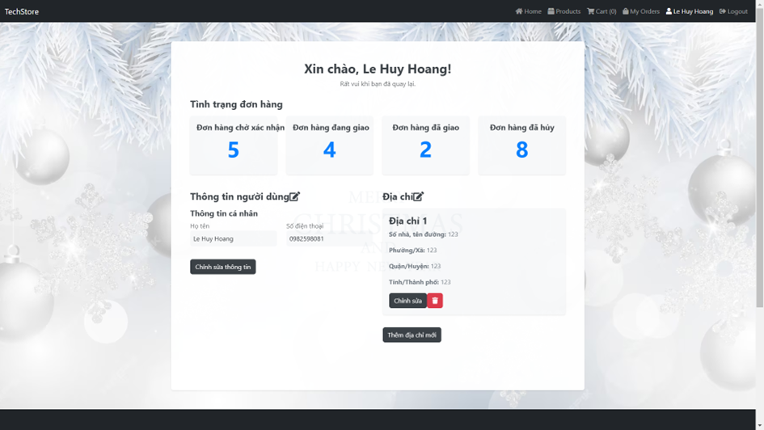
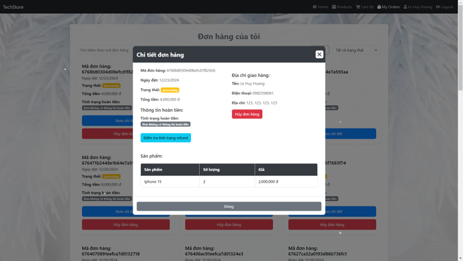
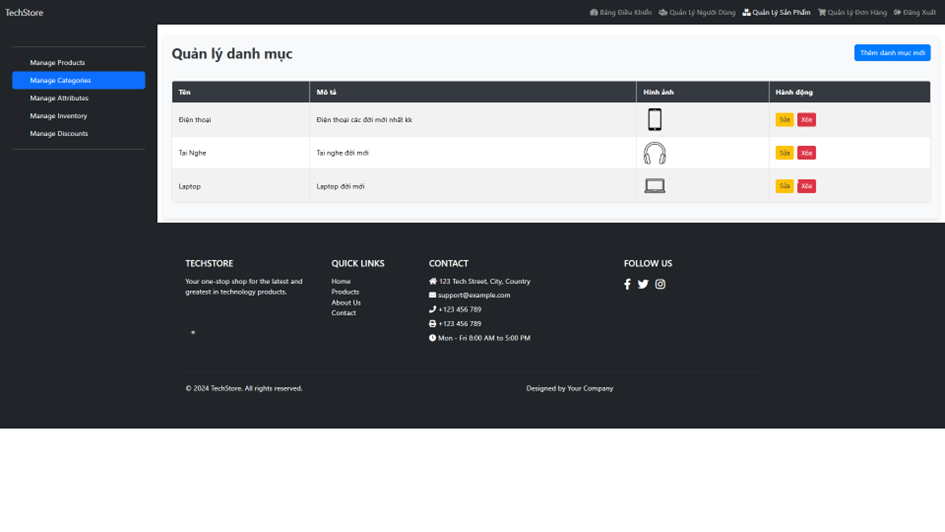
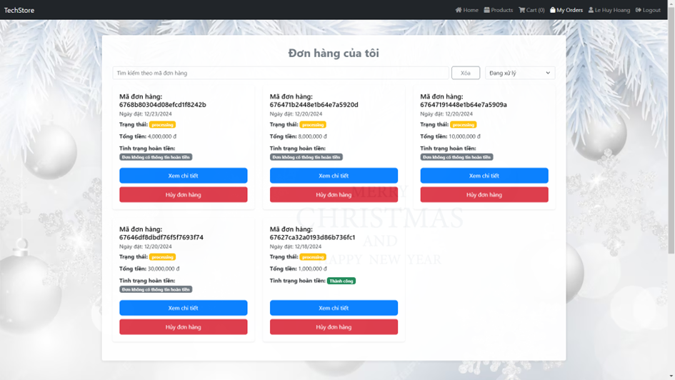

# E-Commerce Website Project with CI/CD on AWS

This repository contains the code for an e-commerce website built for selling technology products. The system includes both customer-facing and admin management features and is designed with a modern microservice architecture. The project also implements a full CI/CD pipeline on AWS, leveraging services such as CodeDeploy and CodePipeline.

> **Note:** This README focuses on technical details.

---

## Table of Contents

- [Project Architecture](#project-architecture)
- [Technologies Used](#technologies-used)
- [Deployment & CI/CD Pipeline](#deployment--cicd-pipeline)
- [Database Schema](#database-schema)

---

## Project Architecture

The system is divided into several layers:

- **Frontend:** Developed using ReactJS combined with Vite for a fast development experience and efficient build process.
- **Backend:** Implemented with Node.js to create RESTful APIs and handle business logic.
- **Database:** Uses MongoDB as the NoSQL database to manage dynamic data such as products, users, orders, and reviews.
- **Containerization:** Docker is used to package the application for consistent deployment across environments.
- **CI/CD Pipeline:** AWS CodePipeline and CodeDeploy automate the testing, building, and deployment processes.
- **Infrastructure:** The project runs on AWS EC2 instances behind an Application Load Balancer (ALB), with proper IAM roles, security groups, and target groups configured.

---

## Technologies Used

- **Frontend:**
  - **ReactJS:** For building reusable UI components.
  - **Vite:** Provides a fast development server and optimized builds.
- **Backend:**
  - **Node.js:** For server-side logic and API handling.
- **Database:**
  - **MongoDB:** NoSQL database for flexible data modeling.
- **Containerization:**
  - **Docker:** Ensures consistency across development, testing, and production environments.
- **AWS Services:**
  - **EC2:** Hosts the backend services and MongoDB.
  - **ALB (Application Load Balancer):** Distributes incoming traffic across EC2 instances.
  - **IAM:** Manages permissions and access control.
  - **CodeDeploy & CodePipeline:** Automate continuous integration and deployment.
  - **Secrets Manager & SSM Parameter Store:** Securely manage environment variables and sensitive data.
- **Version Control:**
  - **Git & GitHub:** For source code management and collaboration.

---

## Deployment & CI/CD Pipeline

### AWS Infrastructure Setup

1. **IAM Roles:**

   - Create an IAM role for your EC2 instances with the required permissions (CloudWatch, SSM, CodeDeploy access).
   - Follow AWS best practices by granting least privilege.

2. **Security Groups:**

   - Set up Security Groups for both ALB and EC2 instances to allow only necessary inbound traffic (e.g., HTTP/HTTPS for ALB, SSH for admin access).

3. **Target Groups & ALB:**

   - Create target groups for both the frontend and backend services.
   - Configure an Application Load Balancer (ALB) with appropriate listeners and rules to route traffic to the correct target groups.

4. **EC2 Instances:**
   - Launch EC2 instances (preferably using Amazon Linux 2) and assign the IAM role.
   - Use User Data scripts for bootstrapping your instances if needed.

### CI/CD with AWS CodeDeploy & CodePipeline

1. **CodeDeploy:**

   - Create a CodeDeploy application and deployment group targeting your EC2 instances.
   - Ensure your EC2 instances are registered in the target groups.

2. **CodePipeline:**

   - Set up a pipeline with GitHub (or your chosen source control) as the source stage.
   - Skip the build stage if you are handling builds with Docker.
   - Add a deploy stage to integrate with CodeDeploy.

3. **Pipeline Execution:**
   - Any commit to the `main` branch triggers the pipeline to automatically build, test, and deploy the latest code to your AWS infrastructure.

---

### Some pictures showing the actual interface

<!-- 

 -->

  
  

  
  

  
  

  
  

